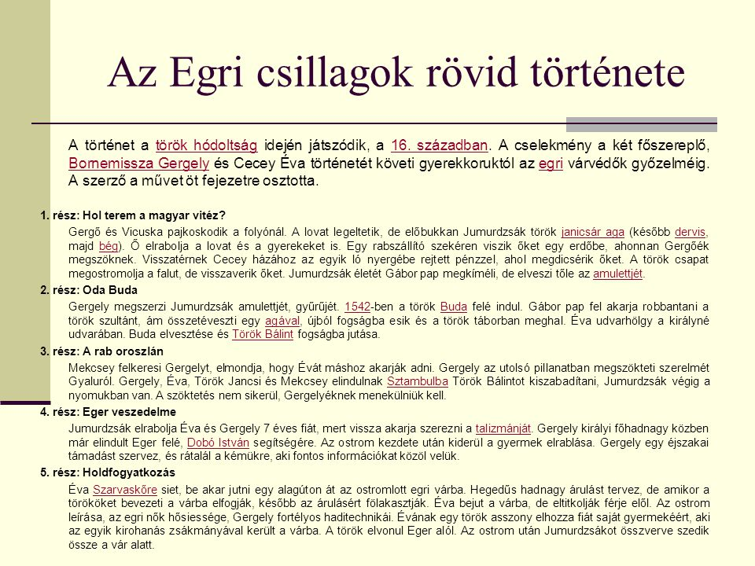
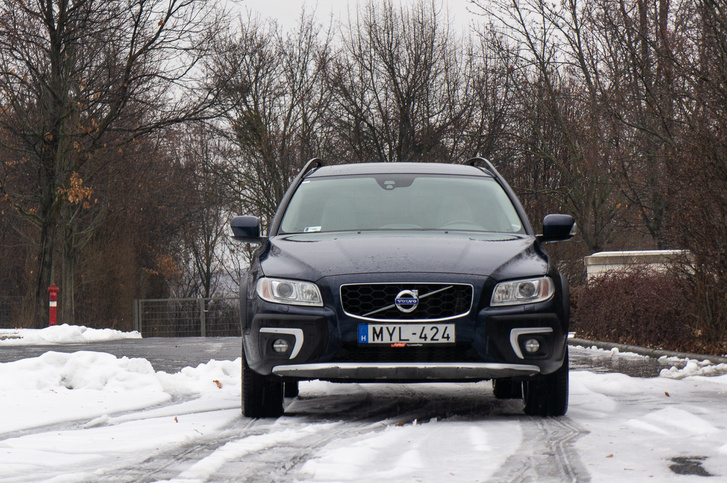
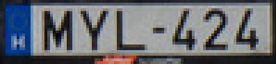

```{r setup, include=FALSE}
knitr::opts_chunk$set(echo = FALSE)

library(magrittr)
library(tesseract)
```

## What is OCR?

OCR = **Optical Character Recognition**
<br>
<br>
```{r, out.width = '75%', fig.align='center'}
knitr::include_graphics("../data/ocr2.jpg")
```

## Motivating Example {.smaller .columns-2}

```{r, out.width = '70%', fig.align='center'}
knitr::include_graphics("../data/xkcd.png")
```

```{r, echo = TRUE}
ocr("../data/xkcd.png") %>% cat()
```

## About Tesseract:

- Began as a PhD project at HP Labs ~ 1985 - 1994  
- Open sourced in 2005. 
- "Developed" by Google since 2006  
- In R: wrapper to libtesseract C++ library by [Jeroen Ooms](https://github.com/jeroen)  
- **v4.0:** introduces the **LSTM**-based engine, released on October 29, 2018. 
- Currently support **101** languages
<br><br>  
- In case you have to work with pdf files: check [pdftools](https://github.com/ropensci/pdftools)

## A Hungarian example

```{r, out.width = '70%', fig.align='center'}

```

## A Hungarian example - results I. {.smaller}
```{r, echo = TRUE}
ocr("../data/egri_csillagok_rov_tortenete.jpg") %>% cat()
```

## A Hungarian example - results II. {.smaller}
```{r, echo = TRUE}
# tesseract_download("hun")
ocr("../data/egri_csillagok_rov_tortenete.jpg", eng = "hun") %>% cat()
```

## Parameters
```{r, eval = FALSE, echo = TRUE}
tesseract_params() %>% head()
```

```{r}
knitr::kable(tesseract_params() %>% head())
```

## Reading car plates
```{r, out.width = '600px', fig.align='center'}

```

## Reading car plates - cropped
```{r, out.width = '450px', fig.align='center'}

```

```{r, echo = TRUE}
ocr("../data/car_plate.png") %>% cat()
```

Check [magick](https://cran.r-project.org/web/packages/magick/vignettes/intro.html) for easy image preprocessing in R

## Page Segmentation
```{r, eval = FALSE, echo = TRUE}
tesseract_params("tessedit_pageseg_mode")
```

```{r}
knitr::kable(tesseract_params("tessedit_pageseg_mode"))
```

## Reading car plates - Page Segmentation + Regex {.smaller}
```{r, echo = TRUE}
ocr("../data/volvo.jpg", eng = tesseract(options = list(tessedit_pageseg_mode = 6))) %>%
    stringr::str_replace_all(" ", "") %>%
    stringr::str_match("[A-Z]{3}-[0-9]{3}")
```

```{r, echo = TRUE}
ocr("../data/volvo.jpg", eng = tesseract(options = list(tessedit_pageseg_mode = 5))) %>% cat()
```

##
Thank you for your attention!
  
For meetup materials, please visit my Github:  
<https://github.com/tomiaJO/tesseract-and-magick-for-OCR>