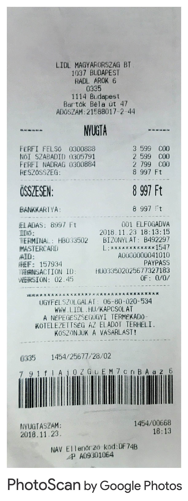

```{r setup, include=FALSE}
knitr::opts_chunk$set(echo = FALSE)

library(magrittr)
library(tesseract)
```

## What is OCR?

OCR = **Optical Character Recognition**
<br>
<br>
```{r, out.width = '75%', fig.align='center'}
knitr::include_graphics("../data/ocr2.jpg")
```

## Motivating Example {.smaller .columns-2}

```{r, out.width = '70%', fig.align='center'}
knitr::include_graphics("../data/xkcd.png")
```

```{r, echo = TRUE}
ocr("../data/xkcd.png") %>% cat()
```

## About Tesseract:

- Began as a PhD project at HP Labs ~ 1985 - 1994  
- Open sourced in 2005. 
- "Developed" by Google since 2006  
- In R: links to libtesseract C++ library (OCR engine)  
- **v4.0:** introduces the **LSTM**-based engine, released on October 29, 2018. 
- Currently support **101** languages

## A Hungarian example

```{r, out.width = '70%', fig.align='center'}
knitr::include_graphics("../data/egri_csillagok_rov_tortenete.jpg")
```

## A Hungarian example - results {.smaller}
```{r, echo = TRUE}
# tesseract_download("hun")
ocr("../data/egri_csillagok_rov_tortenete.jpg", eng = "hun") %>% cat()
```
zr
## A "real life" application - reading customer receipts {.smaller .columns-2}
```{r, out.width = '300px', fig.align='center'}

```

```{r, echo = TRUE}
ocr("../data/receipt2.jpg", eng = "hun") %>% cat()
```

## Parameters
```{r}
# engine <- tesseract(
#     language = "hun",
#     options = list(tessedit_pageseg_mode = 6)
# )
# 
# "../data/receipt2.jpg" %>% 
#     ocr(engine = engine) %>% 
#     cat()
```

##
Thank you for your attention!
  
For meetup materials, please visit my Github:  
<https://github.com/tomiaJO/tesseract-and-magick-for-OCR>